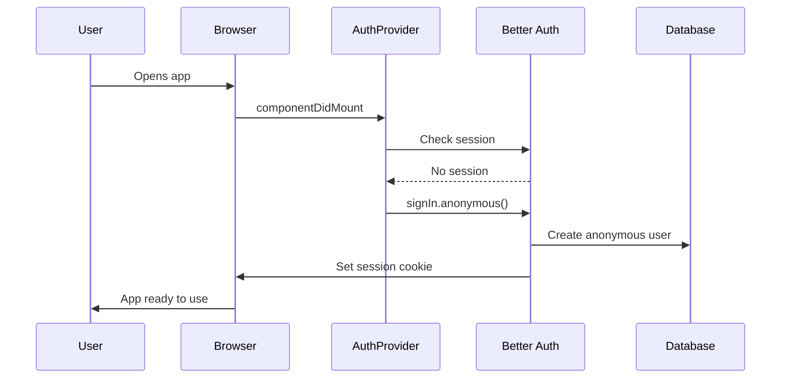
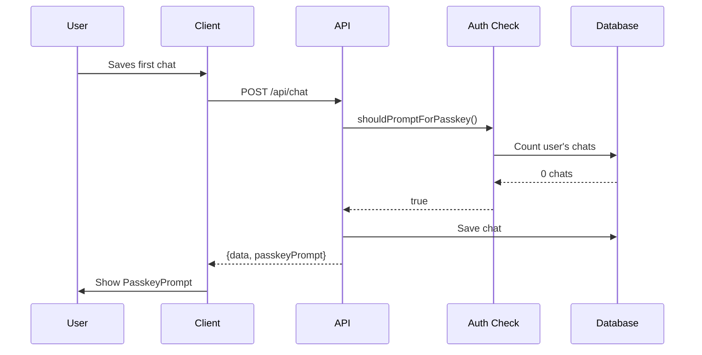
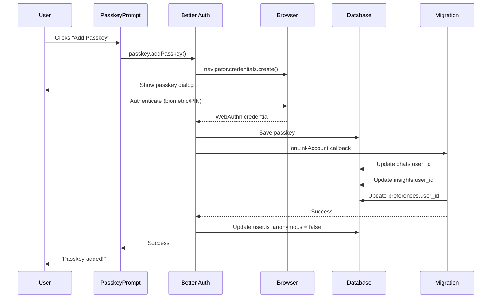
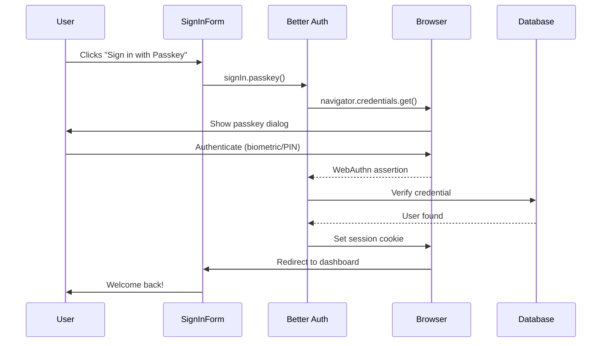

# Authentication System

ReVerse uses a progressive authentication model that prioritizes user experience while maintaining data security and portability.

## Overview

The authentication system is built on Better Auth's `anonymous` and `passkey` plugins, providing:

1. **Immediate Access**: Users can start using the app without any registration
2. **Optional Upgrade**: Users can add passkeys when they want cross-device access
3. **Seamless Migration**: Data automatically transfers when upgrading from anonymous to authenticated

## Architecture

### Components

#### Server-Side

**Better Auth Configuration** (`/src/lib/auth/config.ts`)
- Configures Better Auth with anonymous and passkey plugins
- Sets up relying party (RP) information for WebAuthn
- Defines `onLinkAccount` callback for data migration

**Data Migration** (`/src/lib/auth/migrate-anonymous-data.ts`)
- Migrates chats, insights, and preferences when user adds passkey
- Called automatically by Better Auth during account linking
- Handles errors gracefully with transaction support

**Prompt Logic** (`/src/lib/auth/check-prompt-passkey.ts`)
- Determines when to show passkey prompt
- Checks if this is user's first save action
- Only prompts anonymous users

#### Client-Side

**AuthProvider** (`/src/components/auth/AuthProvider.tsx`)
- Wraps the entire app
- Automatically creates anonymous session on first visit
- Runs on app initialization

**PasskeyPrompt** (`/src/components/auth/PasskeyPrompt.tsx`)
- Displays non-intrusive prompt to add passkey
- Matches app's parchment theme
- Can be dismissed easily

**usePasskeyPrompt Hook** (`/src/hooks/usePasskeyPrompt.ts`)
- Manages prompt display state
- Tracks which triggers have fired
- Stores dismissal state in session storage

#### Database Schema

**Users Table**
```sql
users (
  id UUID PRIMARY KEY,
  email TEXT UNIQUE,  -- Optional for anonymous users
  name TEXT,
  is_anonymous BOOLEAN DEFAULT false,
  email_verified BOOLEAN DEFAULT false,
  image TEXT,
  created_at TIMESTAMP,
  updated_at TIMESTAMP,
  deleted_at TIMESTAMP
)
```

**Passkeys Table**
```sql
passkeys (
  id UUID PRIMARY KEY,
  user_id UUID REFERENCES users(id) ON DELETE CASCADE,
  name TEXT,  -- Device name like "Chrome on MacBook"
  credential_id TEXT UNIQUE NOT NULL,
  public_key TEXT NOT NULL,
  counter INTEGER DEFAULT 0,
  device_type TEXT NOT NULL,  -- 'singleDevice' | 'multiDevice'
  backed_up BOOLEAN DEFAULT false,
  transports TEXT,  -- JSON array of transport types
  created_at TIMESTAMP,
  last_used_at TIMESTAMP
)
```

## User Flow

### 1. First Visit (Anonymous Access)



### 2. First Data Save (Prompt Trigger)



### 3. Adding Passkey (Account Upgrade)



### 4. Sign In from New Device



## Implementation Guide

### Adding a New Prompt Trigger

To add a new trigger point (e.g., when user saves their first bookmark):

1. **Update the hook type**:
```typescript
// src/hooks/usePasskeyPrompt.ts
interface PromptTriggers {
  firstChatSaved: boolean;
  firstInsightSaved: boolean;
  firstSettingsSaved: boolean;
  firstBookmarkSaved: boolean;  // Add new trigger
}
```

2. **Add check function**:
```typescript
// src/lib/auth/check-prompt-passkey.ts
export async function shouldPromptForPasskey(
  userId: string,
  isAnonymous: boolean,
  actionType: 'save_chat' | 'save_insight' | 'save_settings' | 'save_bookmark'
): Promise<boolean> {
  // ... existing code ...
  
  case 'save_bookmark': {
    const existingBookmarks = await db
      .select({ id: savedPassages.id })
      .from(savedPassages)
      .where(and(
        eq(savedPassages.userId, userId),
        eq(savedPassages.isBookmark, true),
        isNull(savedPassages.deletedAt)
      ))
      .limit(1);
    
    return existingBookmarks.length === 0;
  }
}
```

3. **Integrate into API endpoint**:
```typescript
// src/app/api/bookmarks/route.ts
export async function POST(request: NextRequest) {
  const user = await requireAuth();
  
  // Check if should prompt BEFORE saving
  const shouldPrompt = await shouldPromptForPasskey(
    user.id,
    user.isAnonymous ?? false,
    'save_bookmark'
  );
  
  // Save bookmark...
  
  // Include prompt in response if needed
  return NextResponse.json({
    data: bookmark,
    ...(shouldPrompt && { passkeyPrompt: createPasskeyPromptResponse() })
  });
}
```

4. **Handle in client code**:
```typescript
// Component that saves bookmarks
const response = await fetch('/api/bookmarks', { ... });
const { data, passkeyPrompt } = await response.json();

if (passkeyPrompt && !dismissed) {
  setShowPrompt(true);
}
```

### Listing User's Passkeys

To show user their connected devices:

```typescript
// This would be a new API endpoint
// src/app/api/auth/passkeys/route.ts
import { requireAuth } from '@/lib/auth/server';
import { db } from '@/infrastructure/database/client';
import { passkeys } from '@/infrastructure/database/schema';
import { eq } from 'drizzle-orm';

export async function GET() {
  const user = await requireAuth();
  
  const userPasskeys = await db
    .select({
      id: passkeys.id,
      name: passkeys.name,
      deviceType: passkeys.deviceType,
      createdAt: passkeys.createdAt,
      lastUsedAt: passkeys.lastUsedAt,
    })
    .from(passkeys)
    .where(eq(passkeys.userId, user.id));
  
  return NextResponse.json(userPasskeys);
}
```

### Deleting a Passkey

```typescript
// src/app/api/auth/passkeys/[id]/route.ts
export async function DELETE(
  request: NextRequest,
  { params }: { params: { id: string } }
) {
  const user = await requireAuth();
  
  // Verify passkey belongs to user
  const passkey = await db
    .select()
    .from(passkeys)
    .where(and(
      eq(passkeys.id, params.id),
      eq(passkeys.userId, user.id)
    ))
    .limit(1);
  
  if (!passkey.length) {
    return NextResponse.json(
      { error: 'Passkey not found' },
      { status: 404 }
    );
  }
  
  await db.delete(passkeys).where(eq(passkeys.id, params.id));
  
  return NextResponse.json({ success: true });
}
```

## Testing

### Running Tests

```bash
npm test
```

### Test Coverage

- **Hook Tests** (`src/__tests__/hooks/usePasskeyPrompt.test.ts`): 10 tests
  - Initial state
  - Trigger management
  - Dismissal
  - Reset functionality

- **Migration Tests** (`src/__tests__/integration/data-migration.test.ts`): 6 tests
  - Successful migration
  - Error handling
  - Data integrity
  - Empty data handling

- **Workflow Tests** (`src/__tests__/integration/anonymous-auth-workflow.test.ts`): 3 tests
  - Prompt response structure
  - Complete user journey

- **Component Tests** (`src/components/auth/__tests__/SignInForm.test.tsx`): 5 tests
  - Rendering with passkey button
  - Email sign-in
  - Error handling
  - Loading states

## Security Considerations

### WebAuthn Security
- Passkeys are cryptographic and cannot be phished
- Private keys never leave the device
- Public keys stored in database are useless to attackers
- Better Auth handles all WebAuthn complexity

### Session Security
- HTTP-only cookies prevent XSS attacks
- Secure flag ensures HTTPS-only transmission
- SameSite=Strict prevents CSRF attacks
- Sessions managed entirely by Better Auth

### Anonymous User Data
- Anonymous users are real database users
- Data segregation maintained (userId foreign keys)
- No risk of data leakage between users
- Automatic cleanup possible (delete abandoned anonymous users after X months)

### Data Migration
- Migration happens atomically
- Original anonymous user can be deleted after migration
- No data loss during migration
- Error handling prevents partial migrations

## Configuration

### Environment Variables

```env
# Required in production
BETTER_AUTH_SECRET=your-secret-key-min-32-chars

# Auth URL (defaults to http://localhost:3000)
BETTER_AUTH_URL=https://yourapp.com

# Passkey RP ID (defaults based on environment)
PASSKEY_RP_ID=yourapp.com
```

### Development

```typescript
// In development, passkeys work with localhost
rpID: "localhost"
origin: ["http://localhost:3000", "http://localhost:3001"]
```

### Production

```typescript
// In production, use your actual domain
rpID: "yourapp.com"
origin: "https://yourapp.com"
```

## Troubleshooting

### Passkey Registration Fails

**Issue**: User clicks "Add Passkey" but nothing happens or error occurs.

**Solutions**:
1. Check browser console for errors
2. Verify WebAuthn is supported: `window.PublicKeyCredential`
3. Ensure HTTPS in production (WebAuthn requires secure context)
4. Check RP ID matches domain
5. Verify user hasn't hit browser passkey limit

### Anonymous Sign-In Not Working

**Issue**: User gets authentication error on first visit.

**Solutions**:
1. Check AuthProvider is wrapping the app
2. Verify Better Auth configuration includes anonymous plugin
3. Check browser console for errors
4. Verify database migrations have run

### Data Not Migrating

**Issue**: User adds passkey but can't see their old data.

**Solutions**:
1. Check `migrateAnonymousUserData` function logs
2. Verify `onLinkAccount` callback is configured
3. Check database foreign key constraints
4. Ensure userId is being updated correctly

### Prompt Showing Too Often

**Issue**: Passkey prompt appears multiple times.

**Solutions**:
1. Check session storage is working
2. Verify trigger checks are correct
3. Ensure dismissal is being stored
4. Check `markTrigger` logic in hook

## Future Enhancements

### Planned Features

1. **Device Management UI**
   - List all user's passkeys
   - Delete individual passkeys
   - Rename passkeys

2. **Account Recovery**
   - Email backup authentication
   - Recovery codes
   - Account linking

3. **Enhanced Analytics**
   - Track anonymous-to-authenticated conversion rate
   - Monitor prompt dismissal rate
   - Measure passkey adoption

4. **Role-Based Access Control**
   - Premium features for authenticated users
   - Message limits for anonymous users
   - Upgrade prompts for feature access

5. **Social Features**
   - Share insights with other users
   - Follow other users' reading plans
   - Requires authentication

## Resources

- [Better Auth Documentation](https://www.better-auth.com/)
- [WebAuthn Guide](https://webauthn.guide/)
- [Passkeys Introduction](https://developers.google.com/identity/passkeys)
- [Better Auth Anonymous Plugin](https://www.better-auth.com/docs/plugins/anonymous)
- [Better Auth Passkey Plugin](https://www.better-auth.com/docs/plugins/passkey)
